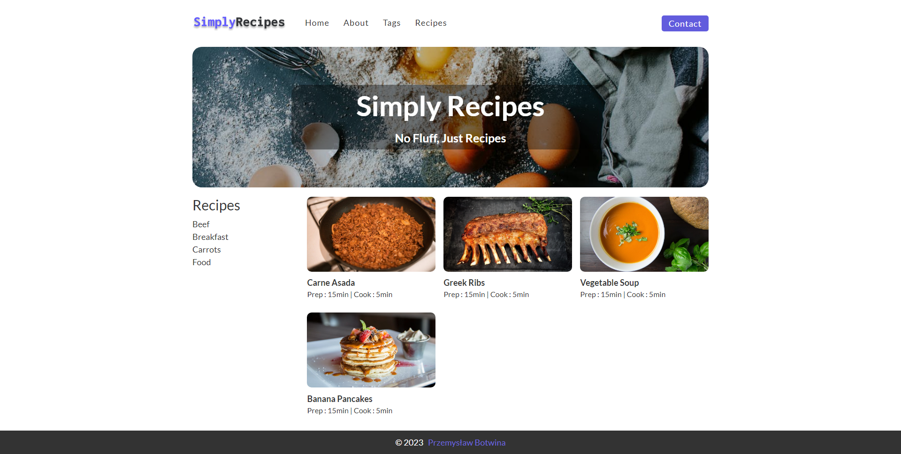

# Simply recipes website

## Overview

The website is about various recipes. The page is nicely responsive, with good contrast, and is friendly for people with disabilities. The main focus was placed on SASS styling and HTML, with only a few lines of JavaScript.

## Screenshot 

## Links

- GitHub repository: [https://github.com/WersV/simply-recipes](https://github.com/WersV/simply-recipes)
- GitHub Pages: [https://wersv.github.io/simply-recipes/](https://wersv.github.io/simply-recipes/)

## Author

- My GitHub profile - [Przemysław Botwina](https://github.com/WersV)